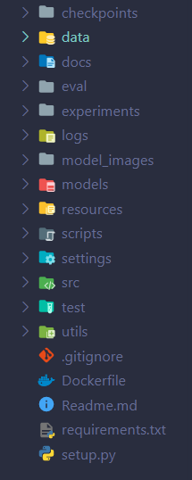

A common api architecture and design language for all machine learning related projects with library support in Python ( with tensorflow(keras) and pytorch framework support ) and C++.
The end goal for the project is to create a design framework for machine learning projects to provide uniformity in the vastly non-uniform world of machine learning research and development projects.
The ProjectAIle provides a common project structure, useful functionality through a standard api and a guideline for taking any product from research to production.
After working on several machine learning projects and facing several difficulties in going from a raw research and experimentation based development to production based development, i've constantly optimized my workflow and development process as well as the code organization structure and have created techniques and methods that can be utilized to reduce the boiler plate stuff and takes out the hassle of re-writing or modifying several mundane tasks that can slow down the speed of development.
Although everyone have their own style of development and their own way of organizing their code, through ProjectAIle, i plan to provide a common checklist or pipeline or workflow which is essentially common in every machine learning project and can be easily modified by anyone or extended upon to customize their workflow.

### The Directory Structure
The ProjectAIle architecture contains the following project structure : <br />



### The API
The aim of the project is to provide helper functions so you've to write minimal code with the likes of the following
```python
from pai.data import IMAGE_FEEDER
from pai.settings import CONFIG
from pai.models import MODEL
from pai.trainer import TRAINER

# Keras Or PyTorch Imports To Create Your Model.

config = CONFIG('./config.json')

class UNET(MODEL):
	def compose_model(self):
		# model code
		return model


model = UNET(config)

feeder = IMAGE_FEEDER(config)

trainer = TRAINER(config, model, feeder)

model = trainer.train()

trainer.evaluate()

pred = model.predict(new_image
```
ProjectAIle will provide extendable classes for the following: <br />
#### 1. DATA_LOADER : (Implicit, uses the feeder to pass in the batch information, the feeder does the loading and pre-processing etc.)
#### 2. FEEDER : (Base class for the feeder where you can define the loading process, the pre-process steps and any augmentations)
#### 3. MODEL : (Base class for the model with all the necessary functions like plotting the model architecture, printing the summary, saving the model weights, loading a model etc.)
#### 4. TRAINER : (The trainer that trains the model and provides the evaluation loops as well, returns the trained model)

#### The Config File:
Config file in projectaile is a json file that is used to define different variables that are used by the projectaile methods and classes for the functionality.
It basically defines the project and model and data configurations.

Here's a sample config.json

```json
{
	"MODEL": {
		"MODEL_NAME": "voice_changer",
		"MODEL_DESCRIPTION": "Replace the voice from a song with your own voice but with the same expressions and tone of the real singer",
		"MODEL_TYPE": "sequence model",
		"PROBLEM_TYPE": "audio deep fake",
		"FRAMEWORK": "tensorflow",
		"MODEL_PARAMS": {
			"INPUT_SHAPE": []
		}
	},
	"DATASET": {
		"SPLIT_DATA": true,
		"TEST_SPLIT_SIZE": 0.1,
		"DATA_TYPE": "audio",
		"DATA": {
			"INTERFACE_TYPE": "dir",
			"DIRECTORIES": "*",
			"FEATURES": "",
			"TARGETS": ""
		},
		"PREPROCESSES": [{
			"type": "length_normalize",
			"params": {
				"max_time": 0.3,
				"sr": 16000
			}
		}, {
			"type": "mel_spectrogram",
			"params": {
				"sr": 16000,
				"n_fft": 1024,
				"hop_length": 512
			}
		}, {
			"type": "normalize",
			"params": {
				"min_db": -100,
				"ref_db": 20
			}
		}],
		"AUGMENTATIONS": [{
			"type": "add_noise",
			"params": {
				"noise_dir": "",
				"noise_ratio": 0.2
			}
		}]
	},
	"HYPERPARAMETERS": {
		"TRAINING_BATCH_SIZE": 8,
		"NUM_EPOCHS": 100,
		"STEPS_PER_EPOCH": 0,
		"LEARNING_RATE": 1e-3,
		"MONITOR_METRIC": "val_loss",
		"SAVE_WEIGHTS": true,
		"EARLY_STOP_EPOCHS": 2,
		"DROPOUT_RATIO": 0.3,
		"LR_DECAY_ALPHA": 0.4
	},
	"CONFIG_INFO": {
		"LOG_DIR": "./logs",
		"MODEL_IMAGE_PATH": "./model_images",
		"CHECKPOINTS_PATH": "./checkpoints"
	}
}
```

###### NOTE : If you're using DLFlow, you don't have to worry about creating the config yourself, just follow the prompts in DLFlow and it'll create the config for you.
###### You can modify it later if needed.

##### The Model config

##### The Dataset config

Defines the structure of the dataset, the type of data and the way of reading the data.

Used by the LOADER and the FEEDER classes to read and create batches of the data.

###### Different Scenarios and their configs.

1. ##### Image configs
	##### 1.1 Image classification
	###### 1.1.1 Directories as labels
	1.1.1.1 Split Data
	```{json}
		"DATASET":{
			"SPLIT_DATA" : true,
			"DATA_TYPE" : "image",
			"TEST_SPLIT_SIZE" : 0.1,
			"DATA":{
				"INTERFACE_TYPE" : "dir",
				"DATA_PATH" :  "/data"
				"DIRECTORIES":"*",
				"FEATURES":"*.jpg|*.png",
				"TARGETS":"__dirname__"
			},
			"PREPROCESSES":[{
				"type" : "resize",
				"params" : {
					"target_size": [512, 512]
				}
			},{
				"type" : "color_normalization",
				"params" : {
					"means" : []
				}
			}],
			"AUGMENTATIONS" : [{
				"type" : "rotate",
				"params" : {
					"min_angle" : 20,
					"max_angle" : 45,
					"prob" : 0.4
				}
			},{
				"type" : "translate",
				"params" : {
					"x_shift" : 100,
					"y_shift" : 20
				}
			}]
		}
	```

	1.1.1.2 Don't Split Data
	```json
		"DATASET":{
			"SPLIT_DATA" : false,
			"DATA_TYPE" : "image",
			"DATA":{
				"INTERFACE_TYPE" : "dir",
				"FEATURES":"*.jpg|*.png",
				"TARGETS":"__dirname__",
				"TRAIN_DATA":{
					"DATA_PATH" : "/data/train/",
					"DIRECTORIES": "*"
				},
				"VALID_DATA" : {
					"DATA_PATH" : "/data/valid",
					"DIRECTORIES": "*"
				}
			},
			"PREPROCESSES":[{
				"type" : "resize",
				"params" : {
					"target_size": [512, 512]
				}
			},{
				"type" : "color_normalization",
				"params" : {
					"means" : []
				}
			}],
			"AUGMENTATIONS" : [{
				"type" : "rotate",
				"params" : {
					"min_angle" : 20,
					"max_angle" : 45,
					"prob" : 0.4
				}
			},{
				"type" : "translate",
				"params" : {
					"x_shift" : 100,
					"y_shift" : 20
				}
			}]
		}
	```
	###### 1.1.2 Using a csv file
	1.1.2.1 Split Data
	```json
		"DATASET":{
			"SPLIT_DATA" : true,
			"TEST_SPLIT_SIZE" : 0.1,
			"DATA_TYPE":"image",
			"DATA": {
				"INTERFACE_TYPE" : "csv",
				"INTERFACE_FILE" : "path_to_csv"
				"DATA_PATH" : "leave_empty_if_csv_contains_path_else_write_path"
				"FEATURES" : ["column_name_in_csv_containing_image_name"],
				"TARGETS" : ["column_name_in_csv_containing_class_name"]
			},
			"PREPROCESSES": [{...}],
			"AUGMENTATIONS" : [{...}]
		}
	```

	1.1.2.2 Don't split the data
	```json
		"DATASET":{
			"SPLIT_DATA" : false,
			"DATA_TYPE":"image",
			"DATA": {
				"INTERFACE_TYPE" : "csv",
				"FEATURES" : ["column_name_in_csv_containing_image_name"],
				"TARGETS" : ["column_name_in_csv_containing_class_name"],
				"TRAIN_DATA":{
					"INTERFACE_FILE" : "path_to_csv"
					"DATA_PATH" : "leave_empty_if_csv_contains_path_else_write_path"
				},
				"VALID_DATA":{
					"INTERFACE_FILE" : "path_to_csv"
					"DATA_PATH" : "leave_empty_if_csv_contains_path_else_write_path"
				}
			},
			"PREPROCESSES": [{...}],
			"AUGMENTATIONS" : [{...}]
		}
	```

	##### 1.2 Object detection
	###### 1.2.1 COCO format
	```json
		"DATASET":{
			"SPLIT_DATA" : true,
			"TEST_SPLIT_SIZE" : 0.1,
			"DATA_TYPE": "image",
			"DATA":{
				"INTERFACE_TYPE":"json",
				"DATA_PATH" :  "/data"
				"DIRECTORIES":"*",
				"FEATURES":"coco",
				"TARGETS":"coco"
			}
		}
	```
	1.3 Segmentation
	1.4 Heatmap or density estimation
	1.5 Generation
	1.6 Inpainting

2. ##### Audio/Signal configs
	##### 2.1 Source separation
	###### 2.1.1 Directories
	2.1.1.1 Split Data
	```json
		"DATASET":{
			"SPLIT_DATA" : true,
			"TEST_SPLIT_SIZE" : 0.1,
			"DATA_TYPE": "audio",
			"DATA":{
				"INTERFACE_TYPE" : "dir",
				"DIRECTORIES": "*",
				"FEATURES" : "*.wav",
				"TARGETS" : "/targets/*.wav"
			}

		}
	```
	2.2 Voice activity detection
	2.3 Phoneme classification
	2.4 Speaker diarization
	2.5 Voice cloning
	2.6 Denoising

3. ##### Text configs
	3.1 Named entity recognition
	3.2 Machine translation
	3.3 Text generation
	3.4 QA
	3.5 Text summarization
	3.6 Token classification

4. ##### Structured Data configs
	4.1 Time series analysis
	4.2 Visualization
	4.3 Regression

5. ##### Hybrid tasks configs
	5.1 Text-to-speech/Speech-to-text
	5.2 Image captioning
	5.3 Speech to face

etc.

##### The Hyperparameters config

##### The Config_info config
